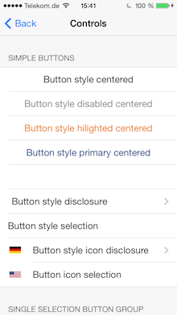
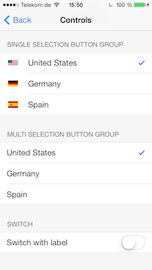
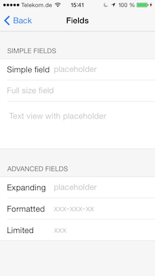
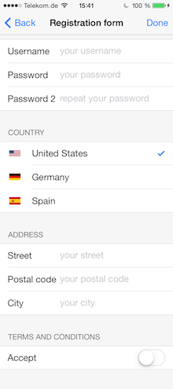

 PAYFormBuilder 
==============
The FormBuilder is a library to create generic iOS 7 screens the easy way. With it's block based syntax and wide possibilities for customization it's fun to create forms.

[](Images/controls.png)
[](Images/controls2.png)
[](Images/fields.png)

Features
--------
* **Easy syntax** - with the block syntax your code is well structured and easy to understand
* **Predefined Styles** - get a seamless iOS 7 feeling without writing one line of styling code
* **Validation** - use validation handling and error message management out of the box
* **Customizable** - change many defaults with UIAppearance or configure each element individually 
* **Example app** - get an overview over all posibilities of the lib and see how to get the best out of it

Usage
-----
In order to create a form screen, you have to inherit from the PAYFormTableViewController and implement the `loadStructure:` method. All of your configuration should take place in this method.

```
#import "PAYFormBuilder.h"

@interface YourViewController : PAYFormTableViewController

@end
```

```
#import "YourViewController.h"

@implementation YourViewController

- (void)loadStructure:(id<PAYTableBuilder>)tableBuilder {
    // Build your form    
}

@end
```

### Sections
With the `tableBuilder` you are able to add sections to the form and do some table wide configuration. To add sections you use the following method or one of its convience counter parts.

```
- (PAYFormSection *)addSectionWithName:(NSString *)name 
 				    	    labelStyle:(PAYFormTableLabelStyle)style 
 						   headerBlock:(void(^)(PAYFormHeader *))headerBlock 
 						  contentBlock:(void(^)(id<PAYSectionBuilder>))contentBlock
``` 

The most important parameter is the `contentBlock` which is defined as `^(id<PAYSectionBuilder> sectionBuilder)`. In this block, you are able to add fields, buttons and more.

### Rows
With the `sectionBuilder` you have a factory object to create a variety of different row types. There are predefined methods to create:

* text fields
* text views
* buttons
* button groups (list of connected buttons)
* switches

But there is also a generic `addView:` method where you get an empty `PAYFormView` which only holds a table view cell you could configure on your own. Please note, that for all row types there are factory methods where you could pass a `configureBlock`, so you could always change them the way you like.

Example
-------
To create a registration form is common task in app development, so it is here used as example to show some of the possiblities of the PAYFormBuilder. To get an overview of all features, please run the example app.

[](Images/registrationForm3.png)

```
#import <UIKit/UIKit.h>
#import "PAYFormBuilder.h"

@interface PAYRegistrationFormViewController : PAYFormTableViewController

@end
```

```
#import "PAYRegistrationFormViewController.h"

@interface PAYRegistrationFormViewController ()

@property (nonatomic, retain) PAYFormSingleLineTextField *userNameField;
@property (nonatomic, retain) PAYFormSingleLineTextField *passwordField1;
@property (nonatomic, retain) PAYFormSingleLineTextField *passwordField2;

@property (nonatomic, retain) PAYFormSingleLineTextField *streetTextField;
@property (nonatomic, retain) PAYFormSingleLineTextField *postalCodeTextField;
@property (nonatomic, retain) PAYFormSingleLineTextField *cityTextField;

@property (nonatomic, retain) PAYFormButtonGroup *countryButtonGroup;
@property (nonatomic, retain) PAYFormSwitch *formSwitch;

@end

@implementation PAYRegistrationFormViewController


- (void)loadStructure:(id<PAYTableBuilder>)tableBuilder {
    [tableBuilder addSectionWithName:nil
                          labelStyle:PAYFormTableLabelStyleNone
                        contentBlock:^(id<PAYSectionBuilder> sectionBuilder) {
        self.userNameField = [sectionBuilder addFieldWithName:@"Username" placeholder:@"your username"
                                               configureBlock:^(PAYFormSingleLineTextField *formField) {
                                                   formField.isRequired = YES;
                                                   formField.minTextLength = 4;
                                               }];
        
        self.passwordField1 = [sectionBuilder addFieldWithName:@"Password" placeholder:@"your password"
                                                configureBlock:^(PAYFormSingleLineTextField *formField) {
                                                    [formField activateSecureInput];
                                                }];
        self.passwordField2 = [sectionBuilder addFieldWithName:@"Password 2" 
                                                   placeholder:@"repeat your password"
                                                configureBlock:^(PAYFormSingleLineTextField *formField) {
                                                    [formField activateSecureInput];
                                                }];
    }];
    
    [tableBuilder addSectionWithName:@"Country"
                          labelStyle:PAYFormTableLabelStyleSimple
                        contentBlock:^(id<PAYSectionBuilder> sectionBuilder) {
                            self.countryButtonGroup = [sectionBuilder addButtonGroupWithMutliSelection:NO
                                contentBlock:^(id<PAYButtonGroupBuilder> buttonGroupBuilder) {
                                    NSArray *countries = @[
                                    		@[@"United States", @"usa"], 
                                    		@[@"Germany", @"de"], 
                                    		@[@"Spain", @"es"]
                                    ];
                                    for (NSArray *country in countries) {
                                        [buttonGroupBuilder addOption:country[1] 
                                        		              withText:country[0] 
                                        		                  icon:[UIImage imageNamed:country[1]]];
                                    }
                                    [buttonGroupBuilder select:@"usa"];
                                }];
                            [self.countryButtonGroup select:YES value:@"usa"];
                        }];
    
    [tableBuilder addSectionWithName:@"Address"
                          labelStyle:PAYFormTableLabelStyleSimple
                        contentBlock:^(id<PAYSectionBuilder> sectionBuilder) {
        self.streetTextField = [sectionBuilder addFieldWithName:@"Street" placeholder:@"your street"
                                                 configureBlock:^(PAYFormSingleLineTextField *formField) {
                                                     formField.isRequired = YES;
                                                     formField.expanding  = YES;
                                                 }];
        
        self.postalCodeTextField = [sectionBuilder addFieldWithName:@"Postal code" 
                                                        placeholder:@"your postal code"
                                                     configureBlock:^(PAYFormSingleLineTextField *formField) {
                                                         formField.isRequired = YES;
                                                         formField.cleanBlock = ^id(PAYFormField *formField, id value) {
                                                             NSString *strValue = value;
                                                             return [strValue stringByReplacingOccurrencesOfString:@" " 
                                                                                                        withString:@""];
                                                         };
                                                     }];
        self.cityTextField = [sectionBuilder addFieldWithName:@"City" placeholder:@"your city"
                                               configureBlock:^(PAYFormSingleLineTextField *formField) {
                                                   formField.isRequired = YES;
                                               }];
    }];
    
   
    
    [tableBuilder addSectionWithName:@"Terms and Conditions" 
                        contentBlock:^(id<PAYSectionBuilder> sectionBuilder) {
        self.formSwitch = [sectionBuilder addSwitchWithName:@"Accept"
                                             configureBlock:^(PAYFormSwitch *formSwitch) {
        	formSwitch.isRequired = YES;
                                                 
           [formSwitch setErrorMessage:[PAYFormErrorMessage errorMessageWithTitle:@"Accept"
                                                                          message:@"Please accept the terms and conditions to continue"]
                          forErrorCode:PAYFormMissingErrorCode];
                                             }];
    }];
    
    tableBuilder.finishOnLastField = YES;
    tableBuilder.selectFirstField = YES;
    
    tableBuilder.validationBlock =  ^NSError *{
        if (![self.passwordField1.value isEqualToString:self.passwordField2.value]) {
            return [NSError validationErrorWithTitle:@"Password wrong" 
                                             message:@"Please enter the same password again" 
                                             control:self.passwordField2];
        }
        return nil;
    };
    
    tableBuilder.formSuccessBlock = ^{
        NSString *msg = [NSString stringWithFormat:@"Well done, %@. Here your cleaned postal code: %@. Country code: %@",
                         self.userNameField.value, self.postalCodeTextField.cleanedValue, self.countryButtonGroup.value];
        
        UIAlertView *alertView  = [[UIAlertView alloc]initWithTitle:@"Success"
                                                            message:msg
                                                           delegate:nil
                                                  cancelButtonTitle:@"Ok"
                                                  otherButtonTitles: nil];
        [alertView show];
    };
}


@end
```

Installation
------------

### Cocoapods

[CocoaPods](http://www.cocoapods.org) is the recommended way to add PAYFormBuilder to your project.

1. Add a pod entry for PAYFormBuilder to your *Podfile* `pod 'PAYFormBuilder'`.
2. Install the pod(s) by running `pod install`.
3. Include PAYFormBuilder wherever you need it with `#import "PAYFormBuilder.h"`.


### Source files

1. Add the repository as a git submodule to your git-tracked project.
2. Drag and drop the **PAYFormBuilder** directory from the archive in your project navigator. Make sure to select *Copy items* when asked if you extracted the code archive outside of your project.
3. Include PAYFormBuilder wherever you need any component with `#import "PAYFormBuilder.h"`.


### Static library

1. Drag and drop **PAYFormBuilder.xcodeproj** in your project navigator.
2. Select your target and go to the *Build Phases* tab. In the *Link Binary With Libraries* section select the add button. On the sheet find and add libPAYFormBuilder.a.
3. Add Target **PAYFormBuilder** to your *Target Dependencies* list.
4. `import <PAYFormBuilder/PAYFormBuilder.h>` whereever you want to use the components. You could add it to your Prefix header file, if you want.

Requirements
------------
* iOS 7
* ARC
* BlocksKit
* libextobjc
* SZTextView